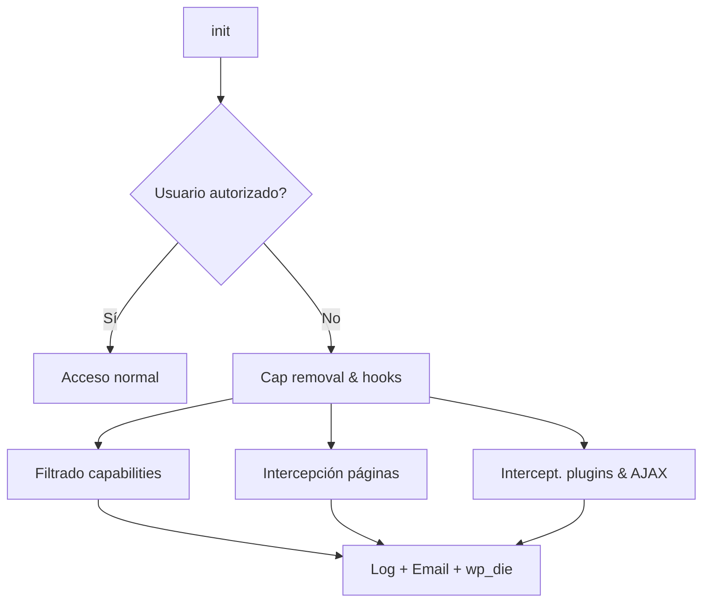

# itecsa Agency Guard – MU-Plugin

> "Porque la mejor seguridad es la que no interfiere con el trabajo diario, salvo cuando es estrictamente necesario."

## Índice
1. Funcionalidades
2. Flujo de trabajo interno
3. Malas prácticas identificadas
4. Posibles mejoras a corto/medio plazo
5. Esbozo de nueva arquitectura orientada a MainWP
6. Créditos y licencia

---

## 1. Funcionalidades
El plugin **`whitelist.php`** restringe, de forma proactiva, acciones críticas en el _admin_ de WordPress para los usuarios que no estén en una lista blanca. A grandes rasgos, aporta:

* **Lista de usuarios autorizados** (`$ITECSA_AUTHORIZED_USERS`).
* **Bloqueo de capacidades peligrosas** (e.g. `delete_plugins`, `switch_themes`).
* **Lista blanca de páginas del admin** y parámetros (`$ITECSA_ALLOWED_ADMIN_PAGES`, `$ITECSA_ALLOWED_PAGE_PARAMS`).
* **Bloqueo de páginas críticas** (e.g. `themes.php`, `update-core.php`).
* **Interceptación temprana** de activación/desactivación de plugins, acciones masivas y AJAX sensibles.
* **Logs y alertas** mediante:
  * _hooks_ propios (`error_log`).
  * Compatibilidad con **WP Activity Log** (`do_action( 'wsal_log', … )`).
  * Envío de **emails** con _throttling_ granular (por usuario y global).
* **UI amigable** (`wp_die` con plantilla HTML) cuando se bloquea una acción.
* Soporte para opciones de ajuste (e.g. `itecsa_guard_custom_allowed_params`, `itecsa_guard_disable_emails`).

## 2. Flujo de trabajo interno


## 3. Malas prácticas identificadas
1. **Hard-code de configuración**
   * Usuarios, emails, páginas y límites están incrustados en el archivo.
   * Dificulta el _deploy_ entre entornos y la gestión por _DevOps_.
2. **Función anónima gigante** en `add_action('init', …)`.
3. **Espacio global saturado**: muchas funciones `function_exists` sin _namespace_.
4. **Uso excesivo de `error_log`** sin niveles ni canalización.
5. **HTML embebido en PHP** para la UI → complica reutilizar la vista.
6. **Falta de _i18n_** (cadenas en duro, sin `__()`/`_e()`).
7. **Sin _composer_ ni PSR-4**: imposible _autoloading_ ordenado.
8. **Pruebas ausentes** (no hay tests ni integración continua).

## 4. Posibles mejoras
* Sustituir los _hard-codes_ por **filtros**, **constantes** o **pantalla de ajustes**.
* Refactor a **OOP + `namespace Itecsa\Guard`**.
* Separar **lógica / presentación / infraestructura**.
* Añadir **traducción** (`load_plugin_textdomain`).
* Usar **monolog** o API de registro de WordPress en vez de `error_log`.
* Incluir **WP-CLI commands** para gestionar lista blanca y parámetros.
* **Tests unitarios** con **BrainMonkey** + **PHPUnit**.
* Cumplir **WordPress Coding Standards** (PHPCS + Pre-Commit hooks).

## 5. Esbozo de nueva arquitectura (Compatibilidad MainWP)
```
itecsa-guard/
├─ bootstrap.php          # Carga mínima, define constantes y arranca el autoload.
├─ composer.json          # Dependencias y PSR-4.
├─ src/
│  ├─ Plugin.php          # Clase principal: registra servicios.
│  ├─ Service/
│  │  ├─ CapabilityGuard.php
│  │  ├─ PageGuard.php
│  │  ├─ AjaxGuard.php
│  │  └─ EmailNotifier.php
│  ├─ Integration/
│  │  └─ WpActivityLog.php
│  └─ MainWP/
│     └─ ChildExtension.php  # Extensión para que el sitio responda a MainWP.
├─ resources/
│  ├─ views/
│  │  └─ blocked.blade.php   # Plantilla vista UI.
│  └─ lang/
│     └─ es_ES.po
├─ tests/                  # PHPUnit + mocks.
├─ assets/
│  ├─ css/
│  └─ js/
└─ README.md
```

### ¿Por qué MainWP?
* Centralizar la gestión de **lista blanca** y **parámetros** desde el _dashboard_.
* Automatizar despliegues de reglas en múltiples sitios.
* Recibir **reportes consolidados** de intentos bloqueados.

### Pasos de migración sugeridos
1. Extraer la lógica del mu-plugin a `src/` usando clases.
2. Crear un **Child Extension** que exponga _REST endpoints_ seguros hacia MainWP.
3. Implementar una **UI en React** dentro del dashboard MainWP para editar ajustes.
4. Publicar la extensión como privada en Composer + Packagist interno.

## 6. Créditos y Licencia
Desarrollado por **itecsa Internet Technologies S.A.**

Licencia: GPL-2.0 o posterior (compatible con WordPress). 
